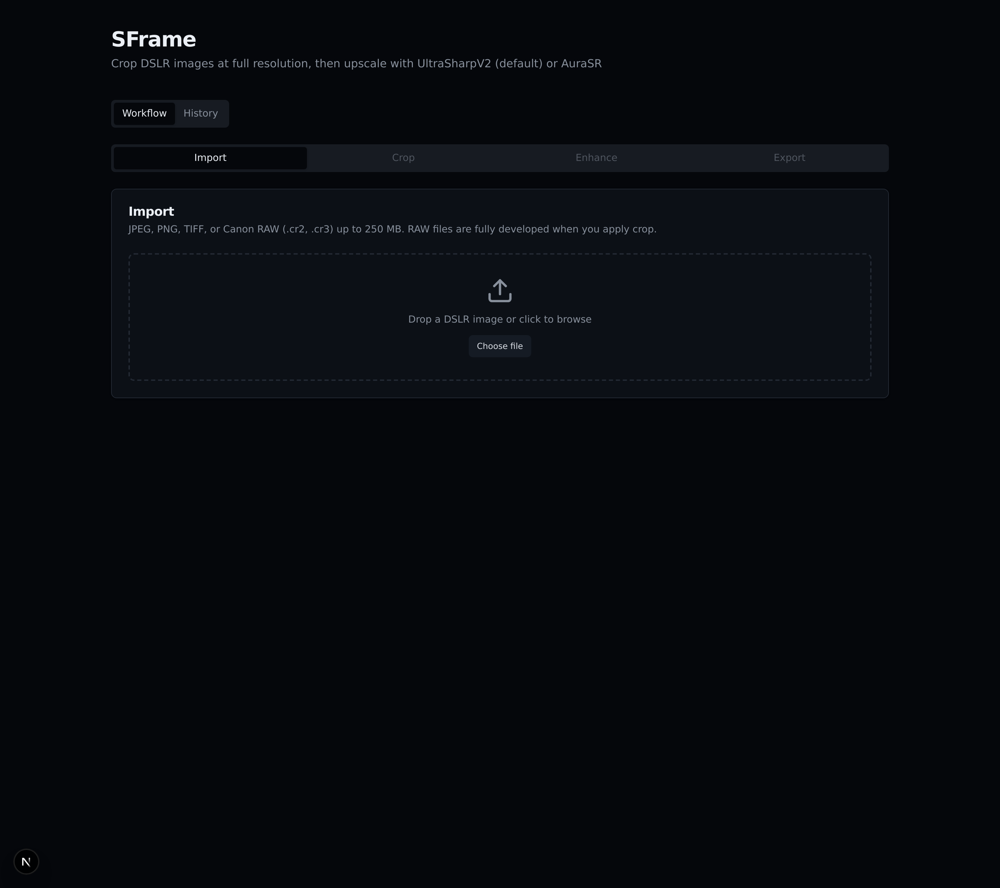
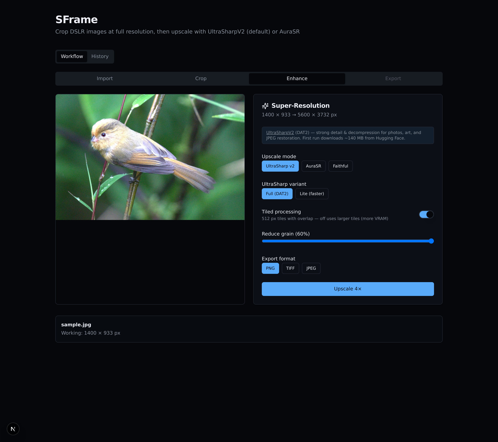
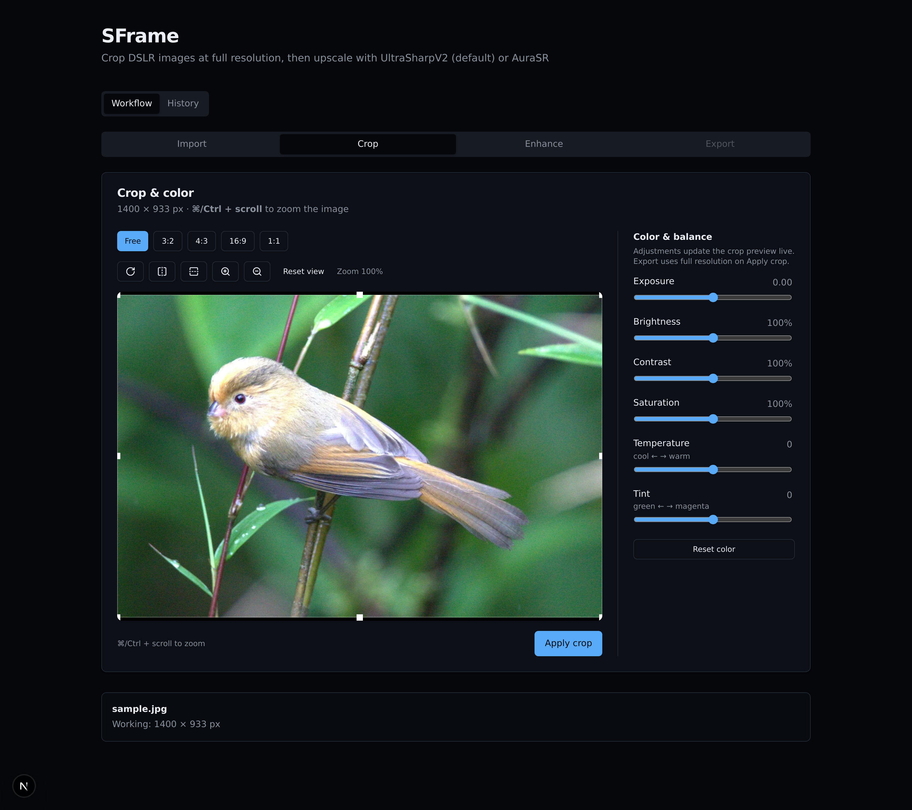
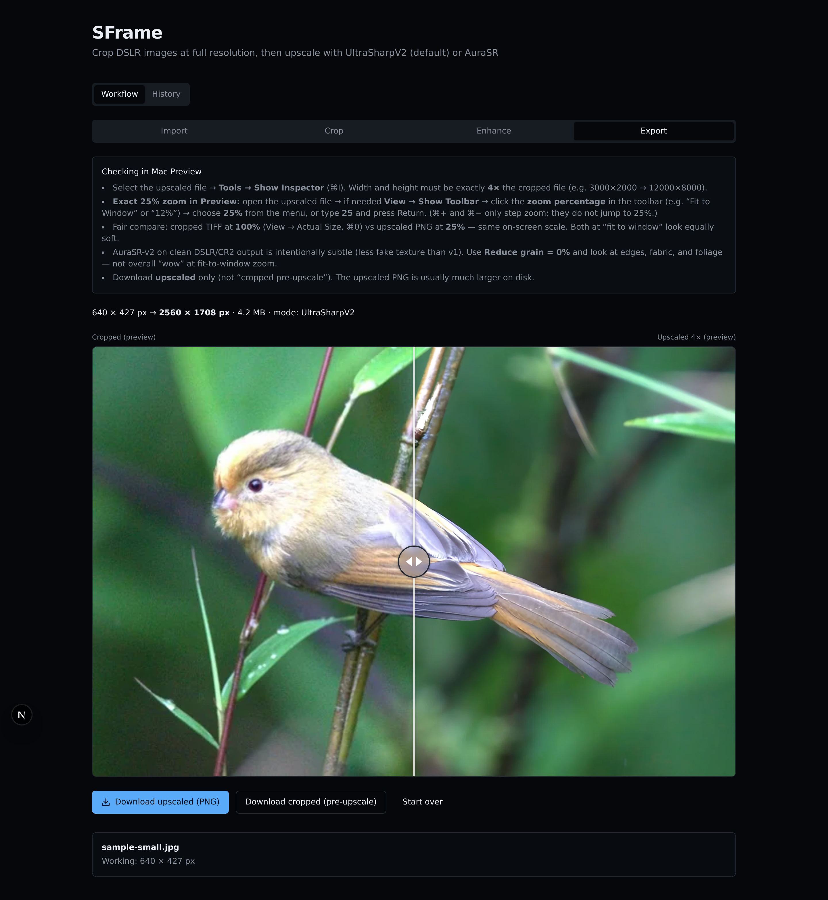
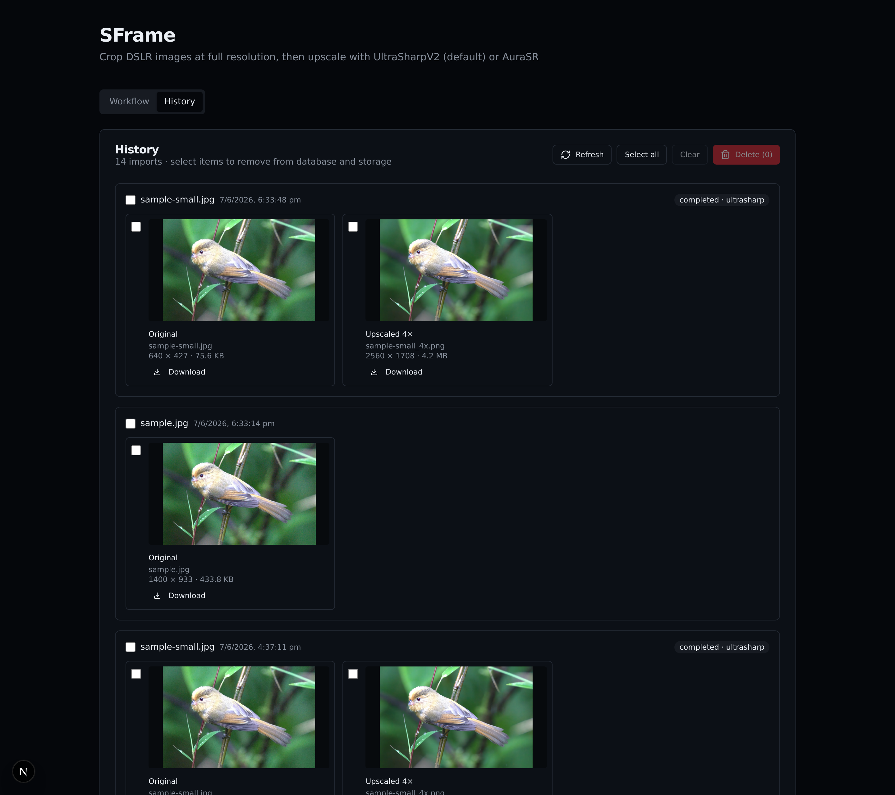

# SFrame: 4× Super-Resolution on Your Own GPU — No Cloud, No Queue

*Crop first, upscale on your NVIDIA GPU, export PNG/TIFF — with optional Canon RAW support baked in.*

---

## The problem with cloud upscalers

You cropped the shot. It’s sharp, well exposed, ready to print — but you don’t have enough pixels.

The usual options:

- **Upload to a cloud service** — wait in queue, pay per image, send full-res files off your machine
- **Desktop apps** — powerful, but another license and another export step
- **Browser “AI enhance” tools** — often capped resolution or locked behind subscriptions

I wanted something simpler: **drop an image in the browser, crop if needed, run 4× super-resolution locally on my GPU, download the result.** No upload pipeline. No account.

That’s **SFrame** — a small app with a Next.js front end and a FastAPI + PyTorch back end. The headline feature is **local 4× upscaling**. Everything else (crop, color, history) exists to get a clean input into the model.


*Import supports JPEG, PNG, TIFF, and Canon RAW up to 250 MB.*

---

## Three ways to upscale

SFrame exposes three modes — different tools for different goals:

| Mode | What it does | Best for |
|------|----------------|----------|
| **UltraSharp v2** (default) | AI detail recovery via [Kim2091/UltraSharpV2](https://huggingface.co/Kim2091/UltraSharpV2) | Sharp prints, recovered fine detail |
| **AuraSR** | GAN-style upscale (v1/v2) | Softer “enhanced” look; v2 is more DSLR-friendly |
| **Faithful** | Lanczos 4× only | No invented texture — resize without hallucination |


*The Enhance panel shows input → output resolution (e.g. 1400×933 → 5600×3732) and exposes mode, variant, tiling, and export format.*

**UltraSharp v2** loads through **spandrel** from Hugging Face on first run (~140 MB). Full and Lite variants are available. Default **grain reduction** (~60%) helps tame noise before the model invents structure on top of it.

**AuraSR** is for when you want a different aesthetic. The UI exposes overlapping tiles, tile weighting (checkboard vs constant), batch size, and optional denoise — the knobs you need when GAN upscalers show seams.

**Faithful** is the sanity check: if AI output looks wrong, compare against pure Lanczos at the same 4× factor.

---

## Why crop before upscale

This isn’t a UX preference — it’s physics.

4× super-resolution multiplies output pixels by **16**. A 4000 × 6000 crop becomes 16000 × 24000. VRAM, disk, and runtime all scale with input area.

SFrame caps the long edge at **4096px before upscale**. The workflow is deliberate:

1. **Import** — JPEG, PNG, TIFF, or Canon RAW
2. **Crop** — frame the shot, optional color tweaks
3. **Enhance** — 4× job on GPU
4. **Export** — download + before/after preview


*Crop and color at full resolution; only the region you keep gets upscaled.*

Upscaling a full sensor image you’re about to crop is wasted GPU time. **Crop first, enhance second.**

---

## Tiled inference: how large images fit in VRAM

A developed photo rarely fits in one GPU forward pass. SFrame **tiles** inference.

For **UltraSharp v2**:

- Default tile size: **512px**
- Overlap: **32px**
- Each tile is upscaled independently
- Overlapping regions are blended with a **linear ramp** so you don’t get visible seams

For **AuraSR**, overlapping tiles are on by default. Checkboard weighting helps hide tile boundaries — a common pain point with patch-based GAN upscalers.

This is the core engineering problem SFrame solves: **full-resolution output without requiring a 48GB GPU.**

---

## Jobs, progress, and honest previews

Upscale runs as a **background job**:

- `POST /api/v1/jobs/upscale` starts work
- The UI polls until `completed` or `failed`
- Progress and messages update in SQLite (`"UltraSharp 4× tiled inference…"`, etc.)


*Compare cropped vs upscaled in the browser, then download the full-resolution file.*

**Important:** judge quality on the **downloaded PNG/TIFF at 100% zoom**, not only the in-app before/after slider. Previews are WebP, capped around ~2048px — fine for composition, not for pixel-peeping AI texture.

---

## Local-first: your GPU, your files, your cache

Models download once to `./.cache/huggingface/`. Assets and job history live under `./data/`. Nothing leaves the machine unless you share it.

| Layer | Tech |
|-------|------|
| Web | Next.js 15, TypeScript, Tailwind |
| API | FastAPI, Pillow, PyTorch |
| UltraSharp | spandrel + Kim2091/UltraSharpV2 |
| AuraSR | aura-sr |
| Jobs / history | SQLite + on-disk assets |

**GPU path:**

```bash
./scripts/docker-up-gpu.sh
# or local dev + ./scripts/install-gpu-torch.sh
```

Check `http://localhost:8100/health` — `cuda_available: true` means you’re on GPU. CPU works; upscaling is just slow.

---

## History: RAW → crop → 4× in one place

Every session is stored locally. History shows the full chain — original (or RAW), cropped TIFF, and upscaled 4× output — with download and delete.


*A completed Canon RAW session: RAW ingest → cropped TIFF → UltraSharp 4× PNG.*

---

## UltraSharp vs AuraSR vs Lanczos — a quick guide

**Use UltraSharp v2 when** you want crisp detail and you’re okay with a slightly “enhanced” look. It’s the default for a reason on DSLR output.

**Use AuraSR when** you prefer a smoother GAN finish or want to experiment with denoise and tile settings.

**Use Faithful when** you don’t want the model to invent detail — architecture, text, or skin where AI sharpening looks wrong.

All three are 4×. There is one serious enlargement step, not a chain of quick 2× passes.

---

## Try it

```bash
git clone <your-repo>
chmod +x scripts/dev.sh scripts/install-gpu-torch.sh
./scripts/dev.sh
```

Open `http://localhost:3000`. Import → crop (if needed) → **Enhance** → download.

Re-capture article screenshots:

```bash
node scripts/capture-article-screenshots.mjs
```

---

## Closing

SFrame is a **local super-resolution workstation** with a browser UI. Crop and color get your pixels ready; **UltraSharpV2 (or AuraSR, or Lanczos) does the enlargement on your hardware.**

If you’re tired of export → upload → wait → download, running 4× tiled inference on your own GPU — with full control over mode, format, and history — is a better fit than another cloud tab.

---

## Screenshot checklist for Medium

| File | Use in article |
|------|----------------|
| `01-import.png` | Hero or intro — shows the app entry point |
| `02-crop.png` | “Crop before upscale” section |
| `03-enhance-ultrasharp.png` | Main SR feature — modes, tiling, 4× dimensions |
| `04-export-before-after.png` | Export / quality judgment section |
| `05-history.png` | Local-first / session management (optional RAW chain) |
**Medium tip:** upload images at full width; add alt text from the captions above. Lead with `03-enhance-ultrasharp.png` if Medium only shows one image in the feed.
